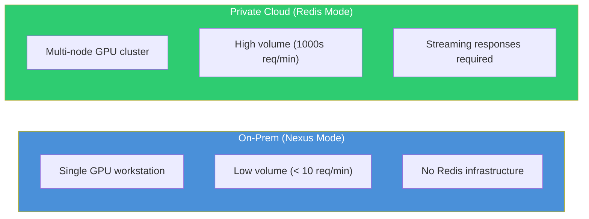
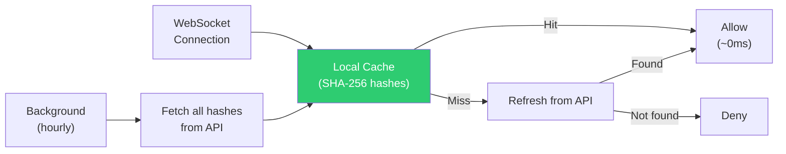

# Design Decisions

This page documents the key architectural decisions in Citadel CLI, the alternatives we considered, and why we chose the path we did. Each section follows the pattern: **decision, context, alternatives, rationale, tradeoffs.**

## Why Go?

**Decision:** Citadel CLI is written in Go.

**Context:** We needed a language that produces a single static binary (no runtime dependencies), supports cross-compilation to Linux/macOS/Windows from a single build, and integrates with tsnet (Tailscale's Go library).

**Alternatives considered:**

| Language | Pros | Cons |
|----------|------|------|
| **Rust** | Performance, memory safety | No tsnet binding, steeper learning curve |
| **Python** | Fast iteration, AI ecosystem | Requires runtime, packaging complexity, GIL limits concurrency |
| **TypeScript/Node** | Team familiarity (AceTeam platform is TS) | Requires Node.js runtime, poor fit for system-level networking |

**Rationale:**

- **tsnet requires Go.** The embedded Tailscale network stack is a Go library. Using another language would mean either maintaining FFI bindings or running Tailscale as a separate process, defeating the purpose of embedding.
- **Headscale fork.** AceTeam maintains a fork of Headscale (the coordination server), which is also written in Go. Sharing the language enables direct integration and code reuse between the Citadel agent and the coordination server.
- **Single binary deployment.** `go build` produces a statically-linked binary with no runtime dependencies. Users download one file and run it. No package managers, no virtual environments, no version conflicts.
- **Goroutines for the worker.** The Redis Streams worker handles concurrent jobs, streaming responses, heartbeat publishing, and terminal sessions simultaneously. Goroutines provide lightweight concurrency (thousands of concurrent operations with minimal memory overhead) without the complexity of async/await or thread pools.
- **Cross-compilation.** `GOOS=linux GOARCH=arm64 go build` produces a Linux ARM64 binary from a macOS development machine. The build matrix in `build.sh` covers 6 platform/architecture combinations from a single codebase.

**Tradeoffs:** Go's type system is less expressive than Rust's. Error handling is verbose. The binary is larger than a C equivalent (~30 MB with tsnet embedded). These are acceptable given the deployment simplicity and tsnet requirement.

## Why Embedded tsnet?

**Decision:** Network connectivity uses Tailscale's tsnet library embedded in the binary, not an external Tailscale installation.

**Context:** Citadel nodes need to join a secure mesh network to communicate with the AceTeam platform. The standard approach would be to require users to install Tailscale separately and configure it to connect to our Headscale server.

**Alternatives considered:**

| Approach | Pros | Cons |
|----------|------|------|
| **External Tailscale** | Battle-tested, kernel WireGuard performance | Requires sudo/admin, external dependency, conflicts with existing Tailscale |
| **Custom WireGuard** | Full control, minimal binary size | Massive engineering effort, NAT traversal is hard |
| **OpenVPN/IPsec** | Widely understood | Complex configuration, poor NAT traversal, higher overhead |
| **Embedded tsnet** | No sudo, no external deps, isolated state | Userspace performance overhead, larger binary |

**Rationale:**

- **No root required.** This is the single most important factor. Requiring `sudo` for installation creates friction, raises security concerns in enterprise environments, and makes the product harder to evaluate. With tsnet, a regular user can run `citadel init` and join the mesh.
- **Windows bundling.** On Windows, an external network client would require a separate installer, MSI package, and system service setup -- adding significant onboarding friction. Embedding tsnet means the Citadel binary is entirely self-contained on all platforms, including Windows.
- **No dependency conflicts.** Many machines already run Tailscale for corporate VPN. An external Tailscale installation for Citadel would conflict with the existing one. tsnet uses a separate state directory and does not touch the host's routing table.
- **Single artifact.** The binary is the complete product. No multi-step installation, no "install Tailscale first" prerequisite, no version compatibility matrix to maintain.

**Tradeoffs:** The binary is ~5 MB larger. Userspace WireGuard has slightly higher CPU overhead than kernel WireGuard, though this is negligible for Citadel's control traffic (job metadata, status updates). Per-application networking means the mesh is only accessible within the Citadel process, not from other applications on the host.

## Why Docker Compose for Services?

**Decision:** Inference engines (vLLM, Ollama, llama.cpp, LM Studio) run as Docker Compose services, with compose files embedded in the binary.

**Context:** Citadel needs to manage AI inference engines on user hardware. These engines have complex dependencies (CUDA, cuDNN, model files) that are impractical to install natively.

**Alternatives considered:**

| Approach | Pros | Cons |
|----------|------|------|
| **Kubernetes** | Industry standard orchestration | Massive overhead for single-node, requires cluster setup |
| **Podman** | Rootless, daemonless | Less ecosystem support, GPU passthrough less mature. Worth revisiting as GPU passthrough matures -- rootless containers would eliminate the Docker daemon dependency. |
| **Native installation** | No container overhead | Dependency hell (CUDA versions, Python versions, library conflicts) |
| **Docker Compose** | Simple, familiar, portable, GPU support | Requires Docker daemon |

**Rationale:**

- **Single-node simplicity.** Kubernetes is designed for multi-node clusters. For a single GPU workstation, it adds enormous complexity (etcd, API server, kubelet, kube-proxy) with no benefit. Docker Compose manages containers on one machine, which is exactly our use case.
- **Familiar to developers.** Most AI/ML engineers know Docker. Compose files are readable YAML. No new concepts to learn.
- **GPU support is mature.** NVIDIA Container Toolkit integrates well with Docker. The `driver: nvidia` specification in compose files is well-documented and widely used.
- **Embeddable.** Go's `embed` package lets us compile compose files into the binary. The `services/compose/` directory becomes part of the artifact. No file distribution needed.

```go
//go:embed compose/*.yml
var composeFS embed.FS
```

**Future consideration:** Podman support is worth exploring once rootless GPU passthrough is stable across distributions. It would remove the Docker daemon as the only external dependency Citadel requires.

**Service management** currently uses subprocess calls to `docker compose`:

```
docker compose -f <path> -p citadel-<name> up -d
docker compose -f <path> -p citadel-<name> down
docker compose -f <path> -p citadel-<name> logs -f
```

The `-p` flag ensures consistent project naming: `citadel-vllm`, `citadel-ollama`, etc.

> **Note:** Subprocess calls to `docker compose` are a known limitation. A future improvement would use a Go library (e.g., the Docker SDK) for container management, improving reliability and error handling.

**Tradeoffs:** Docker daemon is an external dependency (the only one Citadel requires). Docker Desktop on macOS/Windows has licensing implications for large enterprises. Container overhead adds ~50-100 MB memory per service. These are acceptable given the alternative of managing native CUDA/cuDNN installations.

## Why Two Job Processing Modes?

**Decision:** Citadel supports both Nexus HTTP polling and Redis Streams for job processing.

**Context:** We serve two distinct deployment models with very different requirements.



**Rationale:**

- **Nexus mode** is deliberately simple. It requires only HTTP connectivity to the Nexus coordination server. No Redis, no Pub/Sub, no consumer groups. A user with a single GPU workstation should not need to deploy Redis infrastructure to process occasional jobs.
- **Redis mode** is deliberately powerful. Consumer groups provide automatic load balancing across workers. Streams provide persistence and delivery tracking. Pub/Sub enables real-time token streaming. These features are essential for production inference serving but overkill for a single node.

**Why not just Redis for everything?** Because it would force every user to run Redis. The Nexus HTTP polling mode has zero infrastructure requirements beyond the Citadel binary and Docker.

**Why not just HTTP polling for everything?** Because 5-second polling latency and lack of streaming are unacceptable for production inference. Users expect sub-second first-token latency when chatting with an LLM.

**Why not WebSockets?** WebSockets were considered but Redis Streams provides several advantages for this workload:

- **Persistence.** If a worker crashes, unacknowledged messages remain in the stream and can be claimed by another worker. WebSocket messages are lost on disconnect.
- **Consumer groups.** Redis natively distributes messages across multiple consumers with exactly-once delivery semantics. Implementing equivalent fan-out and load balancing over WebSockets requires a custom broker.
- **Replay.** New workers can read historical messages from the stream. WebSockets only deliver live messages.
- **Decoupled producers/consumers.** The Python backend and Citadel workers do not need to maintain persistent connections to each other. Redis acts as the durable intermediary.

**Abstraction:** The codebase already abstracts the job source behind a `JobSource` interface, making it possible to add new transport backends (WebSockets, NATS, etc.) without modifying the worker logic.

## Why Manifest-Driven Configuration?

**Decision:** Node configuration is defined in a `citadel.yaml` manifest file, generated by `citadel init`.

**Context:** We needed a way to define what services a node runs, its identity, and its configuration.

**Alternatives considered:**

| Approach | Pros | Cons |
|----------|------|------|
| **CLI flags only** | No files to manage | Not persistent, error-prone, hard to reproduce |
| **Environment variables** | Twelve-factor compatible | Hard to see full config, no structure |
| **Database/API-driven** | Centralized management | Requires connectivity, complex, hard to debug |
| **SQLite database** | Structured queries, migrations, transactional updates | Not human-editable, harder to debug, overkill for simple config |
| **YAML manifest** | Declarative, version-controllable, portable | One more file to manage |

**Rationale:**

- **Declarative.** The manifest describes the desired state of the node. `citadel up` reads it and converges to that state. This is predictable and reproducible.
- **Version control friendly.** Teams can check `citadel.yaml` into git, template it for fleet deployments, or generate it programmatically.
- **Debuggable.** When something is wrong, `cat citadel.yaml` shows the full configuration. No hidden state, no "what flags did I pass last time."
- **Portable.** Copy the manifest to a new machine, run `citadel up`, and get an identical node.
- **Human-editable.** Unlike SQLite, YAML is readable and editable in any text editor, which matters for operator debugging. When something is wrong, `cat citadel.yaml` shows the full configuration instantly. SQLite would be more appropriate for structured query-heavy configurations, but Citadel's config is small and flat enough that YAML is the better fit.

## Why Platform Abstractions?

**Decision:** OS-specific behavior is handled through runtime detection and interface-based abstractions in `internal/platform/`, not through separate OS-specific binaries.

**Context:** Citadel runs on Linux, macOS, and Windows. Each platform has different package managers (apt/brew/winget), Docker implementations (Engine/Desktop), GPU detection methods (nvidia-smi/system_profiler/WMI), and user management systems (useradd/dscl/net user).

**Alternatives considered:**

| Approach | Pros | Cons |
|----------|------|------|
| **OS-specific binaries** | Simpler per-binary code | 3x maintenance, 3x release artifacts, divergent behavior |
| **Build tags only** | Compile-time selection | Still one binary, but scattered `_linux.go` / `_darwin.go` files |
| **Runtime detection + interfaces** | Single codebase, single release | Slight runtime overhead, all platform code compiled in |

**Rationale:**

The platform package defines interfaces (`PackageManager`, `DockerManager`, `UserManager`, `GPUDetector`) with factory functions that return the correct implementation at runtime:

```go
func GetPackageManager() PackageManager {
    switch {
    case IsLinux():
        return &AptPackageManager{}
    case IsDarwin():
        return &BrewPackageManager{}
    case IsWindows():
        return &WingetPackageManager{}
    }
}
```

- **One release covers all platforms.** A single `build.sh --all` produces binaries for 6 platform/architecture combinations from one codebase.
- **Behavior parity.** All platforms share the same command implementations. Platform differences are isolated to the `internal/platform/` package, making it easy to verify consistency.
- **Easier testing.** Platform interfaces can be mocked in tests without build tags or conditional compilation.

**Tradeoffs:** All platform code is compiled into every binary (slightly larger). Some platform-specific code still requires build tags (e.g., `platform_windows.go` for Windows API calls that do not compile on Linux). The abstraction adds one layer of indirection.

## Why Token Caching in the Terminal Service?

**Decision:** The WebSocket terminal server validates authentication tokens using a local cache of token hashes, refreshed hourly, instead of calling the API for every connection.

**Context:** The terminal service provides remote shell access to nodes. Every WebSocket connection must be authenticated. Calling the AceTeam API for every connection attempt would add latency and create a dependency on API availability.

**Rationale:**



- **Latency.** Local SHA-256 comparison takes microseconds. An API call takes 50-200ms. For interactive terminal sessions, this latency matters.
- **Reliability.** If the AceTeam API is briefly unavailable, existing cached tokens still work. The terminal service does not go down because the auth API is slow.
- **Security.** Only token hashes are cached, never plaintext tokens. The cache refreshes hourly and on cache misses (before rejecting). Exponential backoff (1 second to 5 minutes) prevents thundering herd on API failures.
- **API load.** Without caching, every terminal connection attempt would hit the API. With caching, the API sees one request per hour per node (plus occasional cache-miss refreshes).
