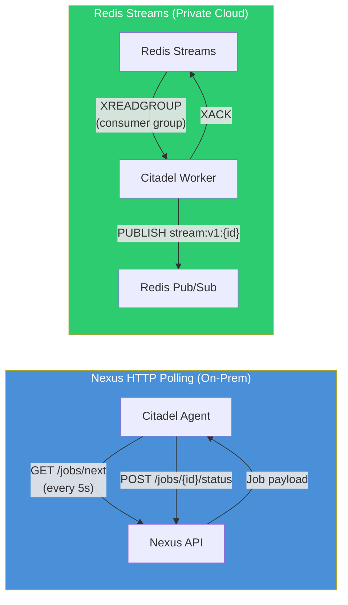
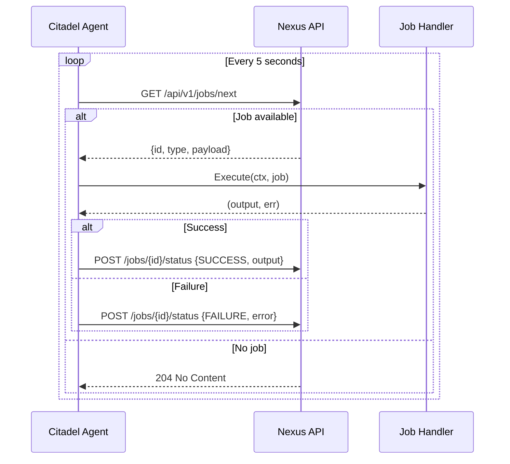
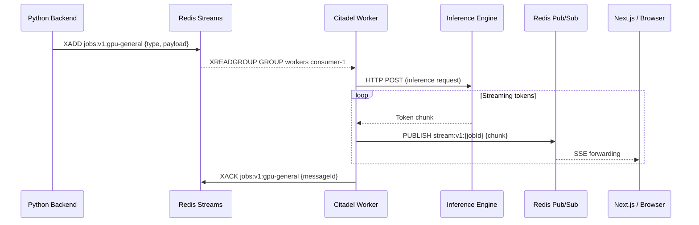
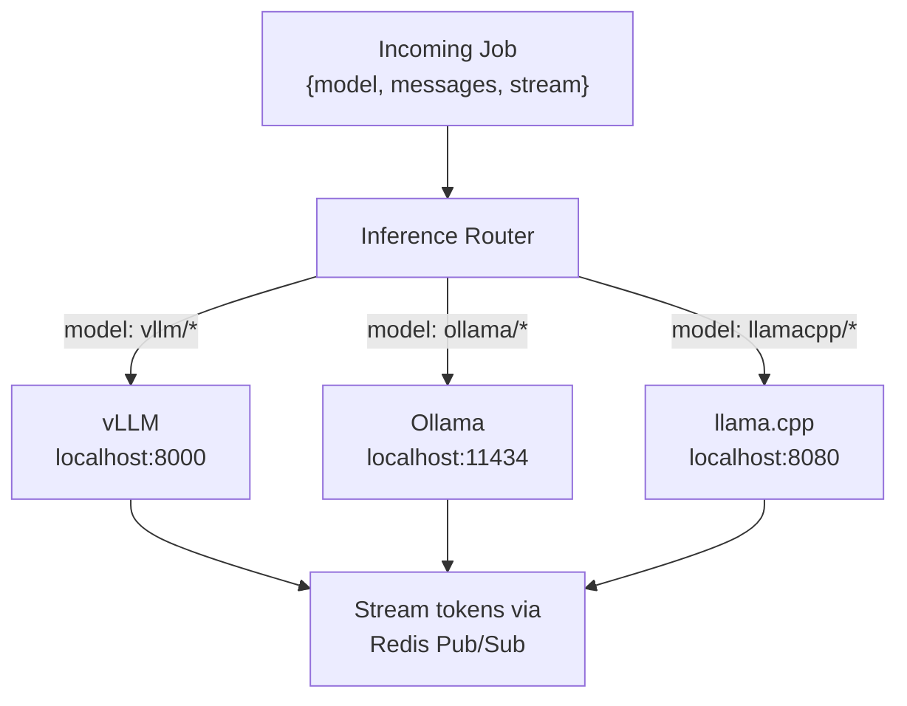

# Job Processing

Citadel supports two job processing modes, each optimized for a different deployment model. This page covers both modes, the handler interface, built-in handlers, streaming, and reliability guarantees.

## Two Modes, Two Use Cases



| | Nexus HTTP Polling | Redis Streams |
|---|---|---|
| **Command** | `citadel agent` or `citadel up` | `citadel work` |
| **Transport** | HTTP to Nexus API | Redis Streams + Pub/Sub |
| **Throughput** | Low (5s polling interval) | High (blocking read, sub-millisecond) |
| **Scaling** | Single node per poll | Horizontal via consumer groups |
| **Streaming** | Not supported | Redis Pub/Sub channels |
| **Use case** | Simple on-prem nodes, low volume | GPU clusters, production inference |
| **State** | Stateless (each poll is independent) | Stateful (consumer group tracks delivery) |

**Why two modes?** They serve fundamentally different deployment models:

- **Nexus mode** is designed for individual on-prem nodes. It is simple, stateless, and requires only HTTP connectivity to Nexus. No Redis infrastructure needed. Ideal for a single GPU workstation in an office.
- **Redis mode** is designed for AceTeam's private GPU cloud. It handles thousands of concurrent inference requests, supports streaming token delivery, and scales horizontally by adding workers to a consumer group. Required for production inference serving.

## Nexus HTTP Polling

The agent loop runs continuously in `citadel agent` (or `citadel up`, which starts services then runs the agent):

1. Poll `GET /api/v1/jobs/next` every 5 seconds
2. If a job is returned, dispatch to the registered handler based on `job.type`
3. Execute the handler and capture output
4. Report status to `POST /api/v1/jobs/{id}/status` with `SUCCESS` or `FAILURE`
5. Resume polling



## Redis Streams Mode

The worker (`citadel work`) connects to Redis Streams as a consumer in a consumer group. This provides automatic load balancing across multiple workers, message persistence, and delivery tracking.



**Consumer group mechanics:**

- Workers join the `workers` consumer group on the `jobs:v1:gpu-general` stream.
- Redis distributes messages across consumers -- each message is delivered to exactly one consumer.
- `XREADGROUP` with `BLOCK` flag means zero polling overhead; workers wake immediately when a message arrives.
- If a worker crashes mid-job, the message remains pending and can be claimed by another worker after a timeout.

## Handler Interfaces

The two modes use similar but distinct handler interfaces, reflecting their different transport requirements.

```go
// Nexus mode handler (internal/jobs/)
// Simple request/response: receive job, return output.
type JobHandler interface {
    Execute(ctx JobContext, job *nexus.Job) (output []byte, err error)
}

// Redis mode handler (internal/worker/)
// Full access to Redis client for streaming, status updates, etc.
type WorkerJobHandler interface {
    Execute(ctx context.Context, client *redis.Client, job *redis.Job) error
    CanHandle(jobType string) bool
}
```

**Why two interfaces?** The Nexus handler is a simple function: take a job, return bytes. It does not need streaming or direct Redis access. The Redis handler needs the Redis client to publish streaming chunks and manage complex multi-step operations. Collapsing them into one interface would either limit Redis mode or add unnecessary complexity to Nexus mode.

## Built-In Handlers

| Handler | Job Type | Mode | Description |
|---------|----------|------|-------------|
| Shell | `shell_command` | Nexus | Execute shell commands on the node |
| LLM Inference | `llm_inference` | Redis | Route inference requests to vLLM, Ollama, or llama.cpp |
| Device Config | `APPLY_DEVICE_CONFIG` | Redis | Apply configuration from onboarding wizard (services, name, settings) |
| Extraction | `extraction` | Redis | Document extraction and processing |
| Model Download | `model_download` | Nexus | Download model files to the node |

### LLM Inference Handler

The inference handler is the most complex. It routes requests to the appropriate local inference engine based on the job payload:



The handler translates the incoming request to the appropriate engine's API format (OpenAI-compatible for vLLM, Ollama's native API, or llama.cpp's API), manages the HTTP connection to the local Docker container, and streams response tokens back through Redis Pub/Sub.

### Device Config Handler

The `APPLY_DEVICE_CONFIG` handler receives configuration from the AceTeam web onboarding wizard and applies it to the node:

```go
// Config fields from the onboarding wizard
type DeviceConfig struct {
    DeviceName              string   // Node display name
    Services                []string // Services to run (vllm, ollama, etc.)
    AutoStartServices       bool     // Auto-start services after config
    SSHEnabled              bool     // Enable SSH access
    CustomTags              []string // Tags for node classification
    HealthMonitoringEnabled bool
    AlertOnOffline          bool
    AlertOnHighTemp         bool
}
```

This enables a zero-touch provisioning flow: the user runs `citadel init` on a bare machine, approves the device in their browser, configures it through the web wizard, and the node automatically applies the configuration without further CLI interaction.

## Streaming Architecture

For inference requests, low-latency token delivery is critical. The streaming path uses Redis Pub/Sub for real-time delivery, bypassing the Streams persistence layer.

```
Inference Engine  -->  Citadel Worker  -->  Redis Pub/Sub  -->  Python Backend  -->  Next.js SSE  -->  Browser
     (HTTP)              (Go)          stream:v1:{jobId}        (subscribe)         (forward)       (EventSource)
```

**Channel naming:** Each job gets a dedicated Pub/Sub channel at `stream:v1:{jobId}`. The client subscribes before the job starts, ensuring no tokens are missed.

**Message format:** Each published message is a JSON object containing the token chunk, finish reason (if complete), and any error information. The Python backend forwards these as Server-Sent Events without transformation.

## Reliability

### Consumer Groups and Delivery Tracking

Redis Streams consumer groups provide at-least-once delivery:

- Each message is delivered to exactly one consumer in the group.
- Messages remain in the Pending Entries List (PEL) until explicitly acknowledged with `XACK`.
- If a consumer crashes, pending messages can be claimed by another consumer after a configurable timeout.

### Dead Letter Queue

Messages that fail repeatedly (after handler retries) are moved to a dead letter queue for manual inspection. This prevents poison messages from blocking the entire queue.

### Graceful Shutdown

When Citadel receives SIGTERM or SIGINT:

1. Stop accepting new jobs (stop calling `XREADGROUP`).
2. Wait for in-flight jobs to complete (with a timeout).
3. Acknowledge completed jobs.
4. Close Redis and network connections.
5. Exit.

This ensures no jobs are lost during deployments or restarts.

### Backpressure

Workers process one job at a time per goroutine. If all worker goroutines are busy, the worker simply does not call `XREADGROUP`, and Redis naturally buffers messages in the stream. This provides implicit backpressure without explicit flow control mechanisms.
