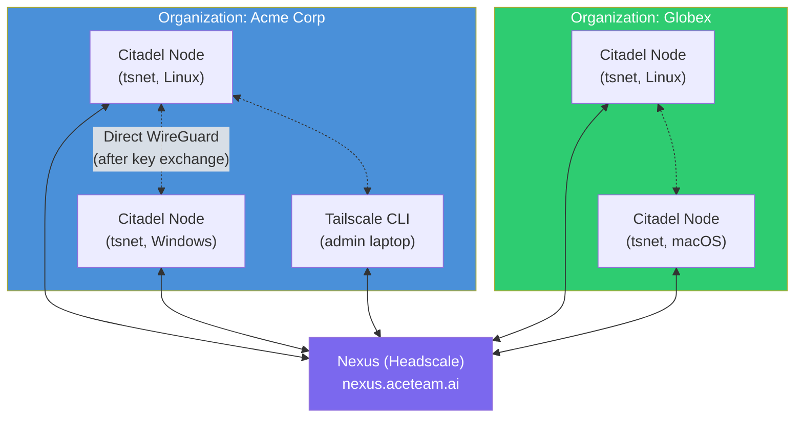

# Mesh Network

Citadel uses embedded tsnet -- Tailscale's Go library -- to create a secure WireGuard mesh network between all nodes in an organization. This page explains why we embed the network stack, how it works, and how it interoperates with the broader Tailscale ecosystem.

## Why Embedded tsnet?

Most distributed systems require users to install and configure a VPN or overlay network separately. Citadel takes a different approach: the entire WireGuard network stack is compiled into the binary using Tailscale's [tsnet](https://pkg.go.dev/tailscale.com/tsnet) library.

**Advantages over system-wide Tailscale:**

- **No root or admin privileges required.** tsnet uses userspace networking -- no kernel modules, no TUN devices, no elevated permissions. A regular user can run `citadel init` and join the mesh.
- **No external dependency.** Users do not need to install Tailscale separately. The binary is self-contained.
- **Isolated state.** tsnet stores its state in `~/.citadel-node/network/`, completely separate from any system Tailscale installation at `/var/lib/tailscale/`. Both can coexist on the same machine.
- **Per-application networking.** The mesh connection is scoped to the Citadel process. It does not affect the host's routing table or DNS configuration.

**Tradeoffs:**

- Binary size increases by approximately 5 MB due to the embedded WireGuard and Tailscale control plane code.
- tsnet uses userspace networking which has slightly higher CPU overhead than kernel WireGuard. For the job metadata and control traffic Citadel sends, this is negligible.

## Network Topology

All Citadel nodes connect to Nexus, an AceTeam-hosted Headscale coordination server. Nexus handles key exchange, NAT traversal coordination, and node discovery -- but does not relay data traffic. Once two nodes have exchanged keys through Nexus, they communicate directly via WireGuard.



**Key properties:**

- **Organization isolation.** Each organization gets its own Headscale user namespace. Nodes in Acme Corp cannot discover or communicate with nodes in Globex.
- **NAT traversal.** Nodes behind firewalls, NAT, or residential connections connect without port forwarding. Nexus coordinates the initial connection; after that, traffic flows directly between nodes via WireGuard's UDP hole-punching.
- **Mixed clients.** Citadel nodes (using embedded tsnet) and regular Tailscale CLI clients interoperate on the same mesh. Both implement the Tailscale v2 control protocol and standard WireGuard.

## Citadel (tsnet) vs Tailscale CLI

Both Citadel and the Tailscale CLI connect to the same Headscale coordination server and speak the same protocols. The difference is scope and privilege level.

| | Citadel (embedded tsnet) | Tailscale CLI |
|---|---|---|
| **Root/admin required** | No (userspace networking) | Yes (system-wide VPN) |
| **Scope** | Per-application (Citadel process only) | System-wide (all processes) |
| **State directory** | `~/.citadel-node/network/` | `/var/lib/tailscale/` |
| **Protocol** | Tailscale v2 + WireGuard | Tailscale v2 + WireGuard |
| **Affects host routing** | No | Yes |
| **DNS integration** | No (application-level only) | Yes (MagicDNS) |
| **Coexistence** | Can run alongside Tailscale CLI | Can run alongside tsnet apps |

**Coexistence:** Because tsnet and the Tailscale CLI use separate state directories, they can run simultaneously on the same machine without conflict. A developer could have system-wide Tailscale for their corporate VPN and Citadel's embedded tsnet for the AceTeam mesh -- both active at the same time.

## Network Package API

All network operations go through the `internal/network/` package, which wraps tsnet with a simplified API. The package maintains a global connection instance.

```go
// Connect establishes a connection to the AceTeam Network.
// It starts the embedded tsnet server and authenticates with Nexus.
// authKey can be empty for interactive device authorization.
network.Connect(nexusURL string, authKey string, stateDir string) error

// Logout disconnects from the AceTeam Network and clears stored state.
network.Logout() error

// IsGlobalConnected returns true if the node is currently connected
// to the AceTeam Network mesh.
network.IsGlobalConnected() bool

// GetGlobalIPv4 returns the node's assigned mesh network IP address.
// Returns empty string if not connected.
network.GetGlobalIPv4() string
```

**Usage in commands:**

- `citadel init` calls `Connect()` with an authkey or triggers device authorization.
- `citadel login` calls `Connect()` with interactive device authorization.
- `citadel logout` calls `Logout()` to disconnect and clear state.
- `citadel status` calls `IsGlobalConnected()` and `GetGlobalIPv4()` to display network info.
- `citadel work` checks `IsGlobalConnected()` before starting the job loop.

## Connection State

Network state is persisted in `~/.citadel-node/network/` and includes:

- WireGuard private key (generated on first connect)
- Node identity and authentication tokens
- Cached peer information for fast reconnection
- tsnet internal state

This state survives process restarts. When Citadel starts, tsnet reads the persisted state and re-establishes the WireGuard tunnel without re-authenticating. If the state directory is deleted, the node must re-authenticate through device authorization or a new authkey.

## Windows: syspolicy Consideration

On Windows, tsnet's `syspolicy` package attempts to acquire a Group Policy read lock via `EnterCriticalPolicySection()`. This call requires an interactive logon session and fails when Citadel runs under WinRM, as a Windows service, or in other non-interactive contexts.

The fix (applied in `internal/network/syspolicy_windows.go`) calls `gp.RestrictPolicyLocks()` before `tsnet.Server.Start()` to disable the lock acquisition, matching the approach used by the upstream `tailscaled` Windows service. The restriction is lifted after startup completes.

## Security Model

- **End-to-end encryption.** All traffic between nodes is encrypted with WireGuard (ChaCha20-Poly1305). Nexus never sees plaintext data.
- **Perfect forward secrecy.** WireGuard performs a new key exchange every 2 minutes.
- **Zero-trust networking.** Nodes authenticate to Nexus and receive cryptographic identities. No IP-based trust.
- **No inbound ports.** Nodes initiate outbound connections only. NAT traversal uses UDP hole-punching coordinated by Nexus. If direct connection fails, traffic relays through DERP servers (encrypted, Nexus cannot decrypt).
