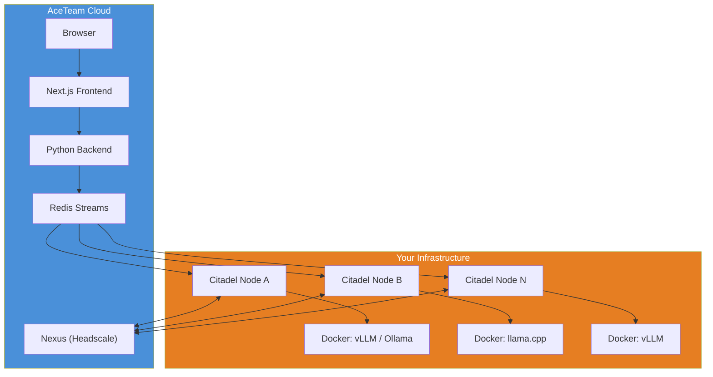
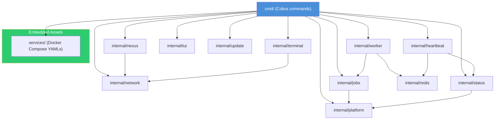
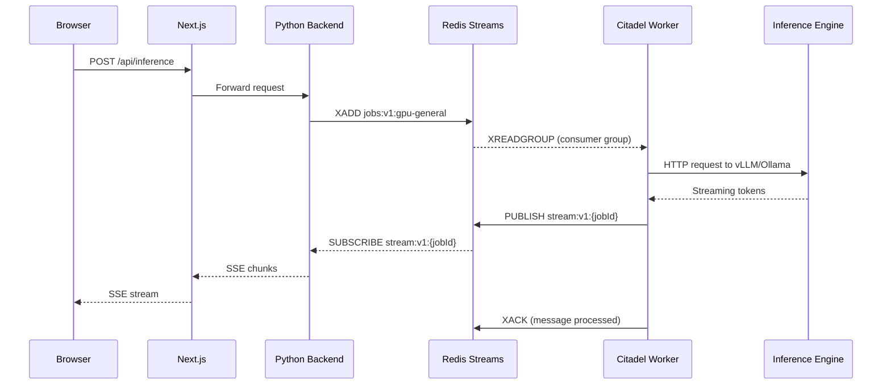
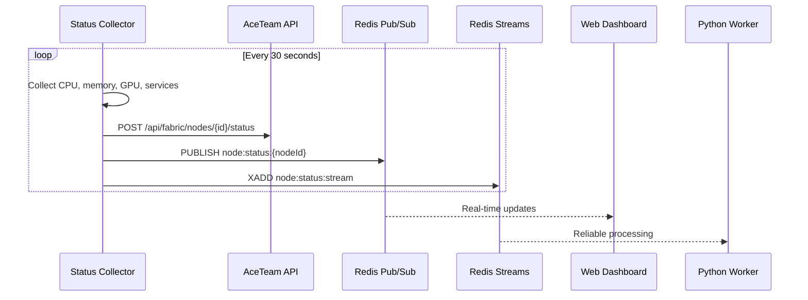
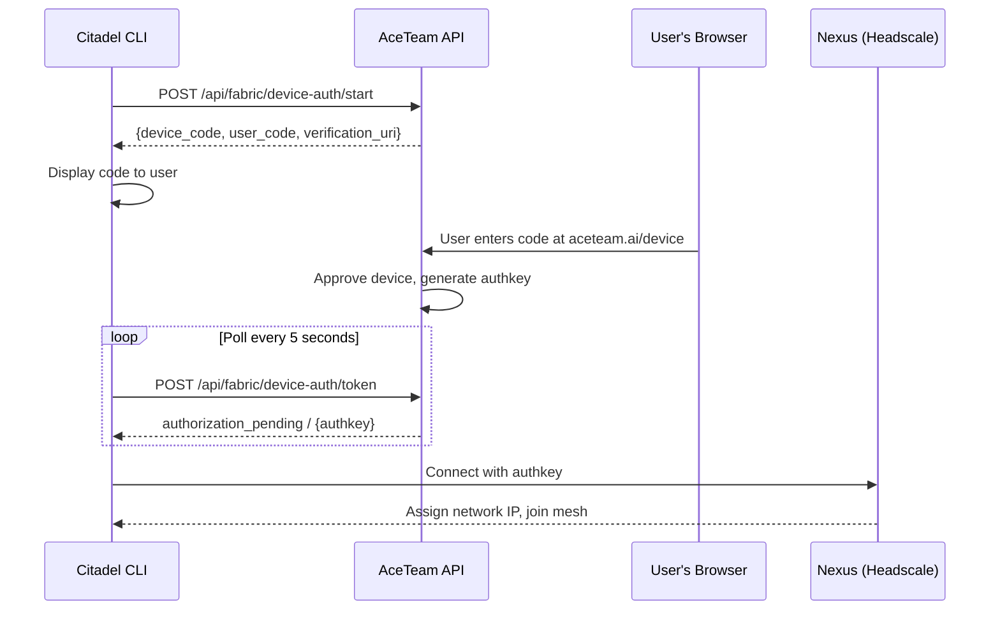

# Architecture Overview

Citadel CLI is a self-contained Go binary that bridges user-owned hardware to the AceTeam cloud platform. It embeds its own network stack, service definitions, and platform abstractions -- no external dependencies beyond Docker. This page covers the high-level system topology, package structure, data flows, and state management.

## System Topology

The AceTeam Sovereign Compute Fabric separates orchestration (cloud) from compute (your hardware). Citadel is the agent that runs on the compute side.

**Key points:**

- The browser never talks directly to Citadel nodes. All requests flow through Next.js server-side routes to the Python backend.
- Redis Streams is the high-throughput job queue connecting the cloud to on-premise workers.
- Nexus (Headscale) manages the encrypted mesh network but does not carry job traffic -- it handles coordination, key exchange, and NAT traversal.
- Each Citadel node runs Docker containers for the actual inference engines.

## Package Dependency Graph

The binary is organized as a standard Go project with Cobra commands in `cmd/` and domain logic in `internal/` packages. The dependency flow is intentionally top-down -- `cmd` depends on `internal`, never the reverse.

**Package responsibilities:**

| Package | Purpose |
|---------|---------|
| `cmd/` | Cobra command definitions -- `init`, `up`, `work`, `status`, `login`, `logout`, `down`, `run`, `logs`, `test`, `agent`, `terminal-server` |
| `internal/worker/` | Unified job runner for Redis Streams and Nexus sources |
| `internal/network/` | Wrapper around tsnet for mesh connectivity |
| `internal/jobs/` | Job handler implementations (LLM inference, shell, config, extraction) |
| `internal/platform/` | OS-specific abstractions (packages, Docker, GPU, users) for Linux/macOS/Windows |
| `internal/heartbeat/` | Status publishing to HTTP API, Redis Pub/Sub, and Redis Streams |
| `internal/status/` | System metrics collection (CPU, memory, GPU, services) |
| `internal/nexus/` | HTTP client for the Nexus coordination API |
| `internal/redis/` | Redis Streams client for job queue operations |
| `internal/terminal/` | WebSocket terminal server with PTY management |
| `internal/tui/` | Bubble Tea terminal UI components |
| `internal/update/` | Self-update with A/B binary rollback |
| `internal/ui/` | Interactive prompts (survey library) |

## Self-Contained Binary

The Citadel binary embeds everything it needs to operate. There are no sidecar processes, no config files to ship, and no runtime downloads (except Docker images for inference engines).

**What is embedded:**

- **Docker Compose files** for all supported services (vLLM, Ollama, llama.cpp, LM Studio) via Go's `embed` package. The `services/compose/` directory is compiled into the binary.
- **Network stack** via tsnet -- the entire WireGuard implementation runs in userspace within the process.
- **Platform abstractions** -- OS detection, package manager selection, Docker management, GPU detection all happen at runtime with no external tooling.

This means a single `citadel` binary (or `citadel.exe` on Windows) is the complete deployment artifact. No installers, no package managers, no configuration management.

## Data Flows

### Job Lifecycle

The primary data flow is an AI inference request traveling from a user's browser to a GPU node and back. Redis Streams provides at-least-once delivery with consumer group tracking.

**Design rationale:** Redis Streams gives us consumer groups (horizontal scaling), message persistence (crash recovery), and delivery tracking (at-least-once semantics) -- all critical for GPU workloads that are expensive to retry.

### Heartbeat and Status Reporting

Every node publishes its health on two channels simultaneously: HTTP for the AceTeam API (reliable, 30-second interval) and Redis Pub/Sub for real-time dashboard updates.

### Device Authorization

New nodes authenticate using the OAuth 2.0 Device Authorization Grant (RFC 8628). The CLI displays a code, the user approves in their browser, and the CLI receives credentials to join the mesh.

**Why device auth instead of API keys?** Device auth eliminates the need to copy-paste secrets. The user authenticates in their browser where they already have a session, and the CLI receives credentials automatically. This matches the pattern used by GitHub CLI and Docker Desktop.

## State Management

Citadel stores state in three locations, each serving a distinct purpose.

| Location | Purpose | Contents |
|----------|---------|----------|
| `~/.citadel-node/network/` | Network identity and connection state | WireGuard keys, tsnet state, cached node info |
| `~/citadel-node/citadel.yaml` | Node manifest (services, identity) | Node name, selected services, service configs |
| Platform config dir | Global system config (fallback) | `/etc/citadel/` (Linux), `/usr/local/etc/citadel/` (macOS), `C:\ProgramData\Citadel` (Windows) |

**Manifest discovery order** (in `cmd/up.go:findAndReadManifest()`):

1. Current working directory -- `./citadel.yaml`
2. Global system config -- `/etc/citadel/citadel.yaml`
3. User home -- `~/citadel-node/citadel.yaml`

The manifest is the source of truth for node configuration. It is generated by `citadel init` and can be version-controlled or templated for fleet deployments.

**Network state** is managed entirely by tsnet and persists across process restarts. Deleting `~/.citadel-node/network/` forces re-authentication on next connect.
