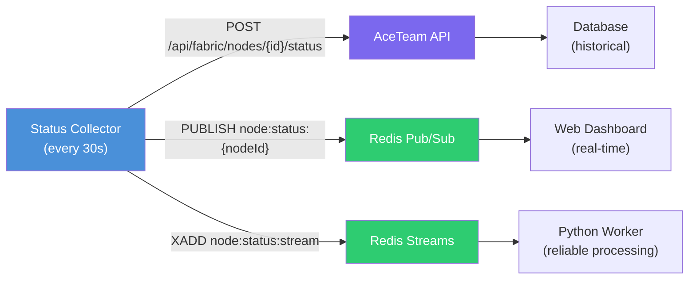
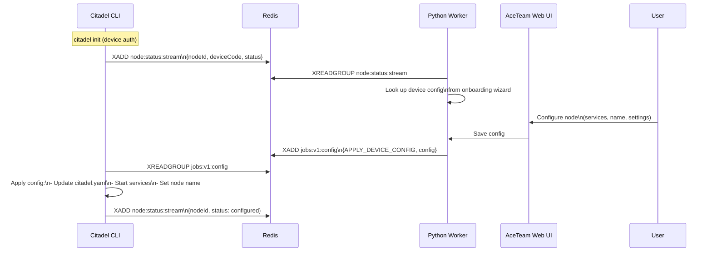

# Status Reporting

Citadel uses a hybrid push model for node telemetry: HTTP for reliable delivery to the AceTeam API, Redis Pub/Sub for real-time dashboard updates, and Redis Streams for reliable processing by backend workers. This page covers the collection, publishing, and consumption of node status data.

## Architecture

**Why three channels?**

| Channel | Guarantee | Latency | Consumer | Purpose |
|---------|-----------|---------|----------|---------|
| HTTP API | Reliable (retries) | ~100ms | AceTeam API | Persistent storage, historical data |
| Redis Pub/Sub | Fire-and-forget | ~1ms | Web dashboard | Real-time UI updates |
| Redis Streams | At-least-once | ~1ms | Python worker | Device config flow, alerting |

The HTTP channel ensures status data is persisted even if Redis is temporarily unavailable. Redis Pub/Sub provides the low-latency path for live dashboards. Redis Streams provides reliable delivery for backend processing that cannot tolerate missed messages (like the device configuration flow).

## What Gets Collected

The status collector in `internal/status/` gathers system metrics using a combination of gopsutil, nvidia-smi, and Docker APIs.

| Category | Metrics | Source |
|----------|---------|--------|
| **CPU** | Usage percentage, core count, model | `gopsutil` |
| **Memory** | Total, used, available, percentage | `gopsutil` |
| **Disk** | Total, used, available for key mount points | `gopsutil` |
| **GPU** | Model, VRAM total/used, temperature, utilization, driver version | `nvidia-smi` CSV output |
| **Network** | Mesh connection status, assigned IP | `internal/network` |
| **Services** | Running/stopped status for each configured service | `docker compose ps` |
| **System** | Hostname, OS, architecture, uptime | `runtime` + `gopsutil` |

**GPU detection** follows a platform-specific fallback chain:

- **Linux:** `nvidia-smi --query-gpu=... --format=csv` (primary), `/proc/driver/nvidia/gpus/` (fallback)
- **macOS:** `system_profiler SPDisplaysDataType` for Metal GPU info
- **Windows:** `nvidia-smi.exe` from standard path, PATH lookup, then WMI query fallback

## Redis Key Patterns

| Key Pattern | Type | TTL | Purpose |
|-------------|------|-----|---------|
| `node:status:{nodeId}` | Pub/Sub channel | N/A | Real-time status updates for dashboard subscriptions |
| `node:status:stream` | Stream | Trimmed by length | Reliable status processing by Python worker |
| `jobs:v1:config` | Stream | Trimmed by length | Config jobs pushed by Python worker back to Citadel |

The `nodeId` in Pub/Sub channels corresponds to the node's mesh network identity, ensuring status updates are routable to the correct dashboard view.

## HTTP Status Server

When running in worker mode (`citadel work`), Citadel exposes local HTTP endpoints for health checking and monitoring integration.

| Endpoint | Method | Response | Purpose |
|----------|--------|----------|---------|
| `/health` | GET | `200 OK` or `503` | Liveness probe (Kubernetes, load balancers) |
| `/ping` | GET | `200 pong` | Simple connectivity test |
| `/status` | GET | JSON status payload | Full node status (same data as published to Redis) |

These endpoints are bound to the mesh network interface, not the public network. Only nodes on the same AceTeam Network mesh can reach them.

## Device Configuration Flow

The status reporting system enables a zero-touch provisioning flow where users configure nodes from the web UI without further CLI interaction.

**Flow breakdown:**

1. User runs `citadel init` with device authorization. The CLI publishes its initial status to Redis Streams, including the `deviceCode` from the auth flow.
2. The Python worker consumes the status message, correlates the `deviceCode` with the user's onboarding wizard session, and retrieves the desired configuration.
3. The user completes the configuration wizard in the web UI (selecting services, naming the node, setting monitoring preferences).
4. The Python worker pushes an `APPLY_DEVICE_CONFIG` job to the config stream.
5. Citadel picks up the config job, updates its local `citadel.yaml` manifest, starts the configured services, and publishes a confirmation status.

This entire flow happens without the user needing to return to the CLI after the initial `citadel init`.

## Status Publisher Implementation

The `internal/heartbeat/` package provides two publisher implementations:

**HTTP Publisher** (`heartbeat/http.go`):
- Posts JSON status to the AceTeam API every 30 seconds.
- Includes retry logic with exponential backoff on transient failures.
- Falls back gracefully if the API is unreachable (logs warning, continues operating).

**Redis Publisher** (`heartbeat/redis.go`):
- Publishes to both Pub/Sub and Streams in a single tick.
- Pub/Sub messages are fire-and-forget (no persistence, no retry).
- Streams messages use `XADD` with `MAXLEN ~1000` to prevent unbounded growth.
- Includes the `deviceCode` field when available (populated from `CITADEL_DEVICE_CODE` environment variable or the device auth flow).

Both publishers run as background goroutines and are started by `citadel work` and `citadel up`.

## Monitoring Integration

The HTTP endpoints and status data format are designed for integration with standard monitoring tools:

- **Kubernetes:** Use `/health` as a liveness probe and `/ping` as a readiness probe.
- **Prometheus:** The `/status` endpoint returns structured JSON that can be scraped by a custom exporter.
- **Alerting:** The Python worker processes status stream messages and can trigger alerts based on node going offline, GPU temperature thresholds, or service failures.
