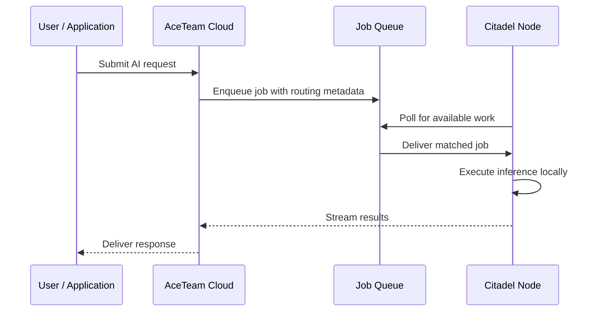

# How It Works

## From Bare Metal to Production in Minutes

Getting a node online follows four steps, regardless of whether you are connecting a single workstation or a rack of GPU servers.

**Install the agent.** Download the Citadel binary for your platform. It is a single file with no external dependencies.

**Join the network.** Run the initialization command. Citadel connects to the AceTeam Network using a secure mesh -- no ports to open, no firewall rules to configure, no VPN client to install. The agent handles all of it.

**Accept work.** Start the worker process. Your node begins polling the AceTeam job queue for inference requests. When a job arrives that matches your node's capabilities, it executes locally and streams results back.

**Scale or earn.** Use your nodes for your own AI workloads to reduce cloud spend, or list your capacity on the AceTeam compute marketplace to generate revenue from idle GPUs.

## Request Flow

When a user submits an AI request through the AceTeam platform, here is what happens:

Notice that **data flows directly between the node and the platform** -- the job queue carries routing metadata, not the actual payloads. Your documents, prompts, and model outputs stay on your infrastructure.

## Key Principles

### Separation of Orchestration and Compute

The AceTeam cloud handles the "what" and "where" -- which jobs exist, which nodes are available, how to route requests for optimal latency and throughput. Your hardware handles the "how" -- the actual model loading, inference execution, and result generation.

This separation means you can scale compute independently of the platform. Adding a new GPU node does not require any cloud-side configuration beyond the node joining the network.

### Queue-Based Workload Distribution

Work is distributed through a job queue, not direct API calls. This design provides natural load balancing, retry handling, and backpressure. If a node goes offline, its pending jobs are automatically redistributed. If all nodes are busy, new jobs queue until capacity is available.

The queue also enables heterogeneous clusters. A node with an NVIDIA A100 and a node with a consumer RTX 4090 can serve the same job queue -- the orchestration layer routes requests based on model requirements and node capabilities.

### Secure Mesh Networking

Every Citadel node connects to the AceTeam Network, a secure mesh that provides:

- **End-to-end encryption.** All traffic between nodes and the platform is encrypted. There is no point in the network where data is decrypted in transit.
- **NAT traversal.** Nodes behind corporate firewalls, residential routers, or carrier-grade NAT connect without any special configuration. No port forwarding required.
- **Organization isolation.** Nodes belonging to different organizations cannot see or communicate with each other. The mesh enforces network-level multi-tenancy.
- **No inbound ports.** Citadel makes only outbound connections. There is nothing to expose, nothing to scan, nothing to attack.

### Zero-Configuration Networking

Traditional distributed systems require careful network planning -- static IPs, DNS entries, load balancer configuration, firewall rules, TLS certificate management. Citadel eliminates all of this.

When a node runs the initialization command, it receives a network identity and a stable IP address on the mesh. Other nodes and the platform can reach it immediately. If the node moves to a different physical network, changes ISPs, or switches from wired to wireless, the mesh adapts automatically. The node's identity and address do not change.

## Scalability

Adding compute capacity to your AceTeam deployment is as simple as installing the Citadel agent on another machine. There is no central configuration to update, no load balancer to reconfigure, no cluster membership to manage.

Each new node independently joins the network, registers its capabilities (GPU model, available memory, supported inference engines), and begins accepting work from the job queue. The orchestration layer discovers new nodes automatically and begins routing work within seconds of the node coming online.

This model scales from a single workstation under a desk to hundreds of GPU servers across multiple data centers -- with the same installation process and the same two commands.
