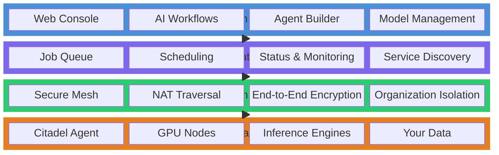

# What is Citadel?

## The Problem

The AI infrastructure market is dominated by three hyperscalers -- AWS, GCP, and Azure -- who collectively control over 65% of global cloud compute. For organizations running AI workloads, this concentration creates three systemic risks.

**Vendor lock-in.** Moving models, data pipelines, and inference endpoints between providers is costly and time-consuming. Once committed, switching costs grow with every month of operation.

**Data sovereignty violations.** Regulated industries -- finance, healthcare, defense, legal -- face strict requirements about where data is processed. Sending sensitive documents to a third-party inference API may violate GDPR, HIPAA, or internal security policies, even if the provider promises encryption at rest.

**Cost unpredictability.** GPU instance pricing changes without notice. Reserved capacity requires upfront commitment. Spot instances disappear mid-job. Organizations with their own hardware find themselves paying cloud rates anyway because there is no simple way to use what they already own.

Meanwhile, billions of dollars of GPU capacity sits idle in enterprise data centers, university labs, and edge locations -- hardware that could be running AI workloads but lacks the software layer to connect it to the workflows that need it.

## The Solution

Citadel is the on-premise agent for the AceTeam Sovereign Compute Fabric. It is a single binary that you install on any machine with a GPU. Once installed, it connects your hardware to the AceTeam platform so you can run AI inference workloads -- LLM serving, document processing, embedding generation -- on infrastructure you own and control.

The model is straightforward:

1. **Install the agent** on your hardware (Linux, macOS, or Windows).
2. **Join the AceTeam Network**, a secure mesh that connects your nodes to the platform without opening inbound ports.
3. **Accept work** from the AceTeam job queue -- inference requests routed to your hardware automatically.

Your data never leaves your infrastructure. The AceTeam cloud handles orchestration, scheduling, and monitoring. Your hardware handles the compute. The two communicate over an encrypted mesh network with no intermediate data storage.

## How AceTeam Compares

|  | AceTeam + Citadel | AWS / GCP / Azure | Vast.ai | Akash |
|---|---|---|---|---|
| **Data Sovereignty** | Full -- data stays on your hardware | Shared infrastructure, data in provider regions | Third-party GPUs, no data guarantees | Decentralized, variable trust |
| **AI-Native Tooling** | Built-in: workflows, agents, model management | Assemble from 50+ services | GPU rental only | General-purpose compute |
| **Orchestration** | Managed from AceTeam cloud, runs on your metal | Fully cloud-managed | Manual | Smart contract-based |
| **Bring Your Own Hardware** | Yes -- any machine with a GPU | No | Providers only | Providers only |
| **Multi-Provider AI** | Route across OpenAI, Anthropic, and private models | Provider-specific | N/A | N/A |

## Where Citadel Fits

Citadel is one layer in the AceTeam Sovereign Compute Fabric, a four-layer stack that separates orchestration from compute.

**Your Infrastructure** is the bottom layer -- the physical or virtual machines you control. Citadel runs here as a lightweight agent alongside your AI inference engines (vLLM, Ollama, llama.cpp, or LM Studio).

**AceTeam Network** provides encrypted connectivity between your nodes and the platform. No VPN appliances, no firewall rules, no port forwarding. Nodes behind NAT, corporate firewalls, or on residential connections all work seamlessly.

**Orchestration Layer** lives in the AceTeam cloud. It decides which node handles which request, monitors health, and manages the job queue. It never touches your data -- only routing metadata.

**AceTeam Platform** is the user-facing layer: the web console where teams build AI workflows, manage models, and monitor their infrastructure.

The key architectural principle is that **orchestration and compute are separated**. The cloud decides what runs where. Your hardware does the actual work. Data flows directly between your nodes and the end users -- never through AceTeam's servers.
